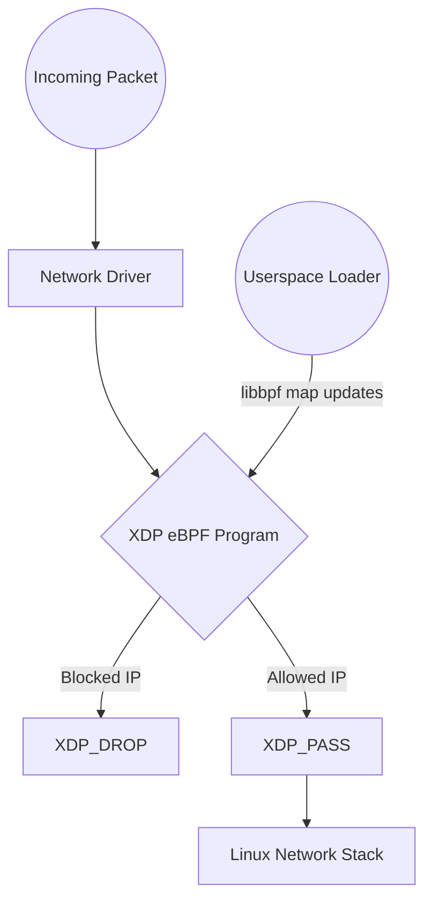

# XDP Packet Filter
[](AGENTS.md)

> **Project Summary:**  
> An eBPF/XDP firewall demonstrating kernel-level packet inspection in restricted C. It drops malicious IPv4 traffic at the network driver level (before the TCP/IP stack) based on an eBPF Hash Map. It includes a `libbpf` userspace loader that exposes a Unix Domain Socket to dynamically inject IPs into the blocklist, bypassing traditional iptables overhead.

## Table of Contents
1. [System Architecture](#system-architecture)
2. [Getting Started](#getting-started)
3. [Usage](#usage)

## System Architecture



## Getting Started

### Prerequisites
- Clang (for compiling BPF object)
- `libbpf-dev` and `libelf-dev`
- CMake >= 3.14

### Build Instructions
```bash
mkdir build && cd build
cmake ..
cmake --build .
```

## Usage
Attach the XDP firewall to an interface (requires root):
```bash
sudo ./xdp_loader eth0
```
Then issue commands via the Unix socket (`/tmp/xdp_firewall.sock`) to dynamically block IPs.

## Agentic AI Development
This repository is fully compliant with the [AGENTS.md](https://agents.md) open standard. It includes strict, drop-in operating instructions designed to correctly guide autonomous AI coding agents (such as Cursor, Devin, Copilot, or Antigravity) across the restricted C and eBPF constraints of this codebase. By providing explicit boundaries, the AI is prevented from hallucinating architectural decisions or making non-deterministic kernel allocations.
